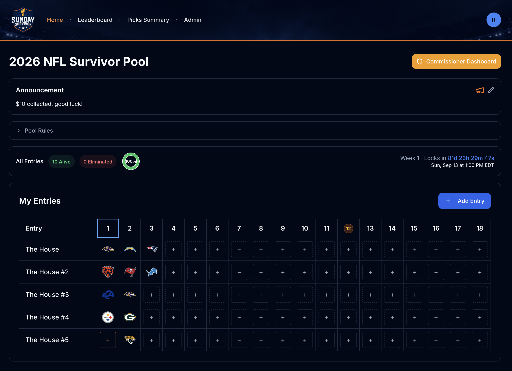

# SundaySurvivor

A production NFL Survivor pool platform. Players join a pool, pick one team to win each week, and get eliminated when their pick loses. Last entry standing takes the pot.

**Live at [sundaysurvivor.com](https://sundaysurvivor.com/?utm_source=github&utm_medium=referral&utm_campaign=overview-repo)**

*Player view: managing multiple entries across the season, with a live lock countdown and alive/eliminated tracking.*

I built and operate this as a real, paying product running live pools during the NFL season. This repo is a public write-up of the project for reference. **The source code is private.**

The whole thing was built by directing [Claude Code](https://claude.com/claude-code). I architected the product, made the engineering and product calls, and drove the implementation through the agent. It's how I describe my work everywhere: I'm the operator and the decision-maker, the AI is the tool.

---

## Stack

**Frontend**
- React 18 + TypeScript, built with Vite
- Wouter for routing, TanStack Query for server state
- Tailwind CSS + Radix UI primitives (shadcn-style component layer)
- TanStack Virtual for large-list rendering (leaderboards with thousands of entries)
- React Hook Form + Zod for forms and validation

**Backend**
- Node.js + Express (TypeScript end-to-end)
- Prisma ORM against PostgreSQL (Neon)
- Passport for auth: local (email/password, bcrypt) and Google OAuth
- Server-Sent Events for live score and standings updates
- node-cron for scheduled jobs (grading, deadlines, recaps)

**Infrastructure & services**
- Hosted on Render (persistent server, not serverless) with edge caching
- Neon Postgres (separate dev and prod databases; pooled connections at scale)
- Stripe for payments
- Resend for transactional email, with bounce/complaint webhooks for list hygiene
- Sentry for error monitoring
- Anthropic API for AI-generated weekly recap emails

---

## Architecture

It's a single TypeScript codebase split into `client/`, `server/`, and `shared/`.

- **Real-time updates.** Game scores and standings push to connected clients over SSE rather than polling. Picks use optimistic UI so the interaction feels instant, with the server reconciling.
- **Multi-tenant pools.** The data model is built around pools, members, and entries. A single user can hold multiple entries across multiple pools, including double-pick weeks where two picks are required. Commissioners get an admin dashboard to run their own pool.
- **Pick deadlines as policy.** Lock times are a commissioner-set policy per pool-week, computed centrally, not naively tied to the first kickoff. The NFL schedule has Wednesday openers and international morning games, and the deadline logic accounts for that.
- **Grading pipeline.** Scores are set and picks graded through secured admin endpoints that invalidate the live cache without a restart. Eliminations, standings, and the resulting notifications all cascade from grading.
- **Scale-conscious reads.** Leaderboards virtualize on the client and batch on the server to avoid N+1 queries; maintenance jobs skip archived pools, which render from a stored snapshot instead of live tables.
- **SEO.** Marketing routes are prerendered to static HTML at build time via Vite SSR; the logged-out landing page is served as static HTML behind a cookie gate, while the app shell stays a normal SPA.
- **Email.** Transactional sends (invites, eliminations, weekly recaps) go through Resend. Recap content is generated with the Anthropic API against a brand-voice prompt. Bounces and complaints auto-suppress via webhook.

---

## Feature set

**Players**
- Join a pool by link and register one or more entries
- Make weekly picks with a live deadline countdown and instant feedback
- Live leaderboard and standings that update as games finish
- Per-entry history, elimination status, and past-season archives
- Account management, password reset, email preferences with one-click unsubscribe

**Commissioners**
- Create and configure a pool (pick rules, deadlines, double-pick weeks)
- Pay upfront via Stripe to run the pool, with tiered pricing based on entry count
- Admin dashboard for members, entries, and announcements
- Grade weeks and set scores, triggering eliminations and notifications
- AI-generated weekly recap emails to the whole pool

**Platform**
- Rate limiting and abuse protection, Helmet security headers, session-based auth
- Audit logging of significant actions
- Error monitoring and email deliverability webhooks
- Separate dev/prod databases and a seed pipeline that preserves real data

---

## Notes

The source repository is private. This README exists to give a real picture of the architecture and scope behind the project.
